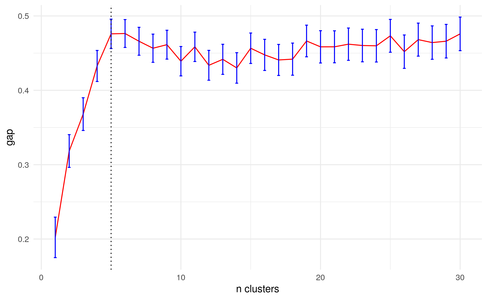

```{r setup, include=FALSE}
knitr::opts_chunk$set(echo = TRUE, scipen=999)
```

```{r message=FALSE, warning=FALSE, include=FALSE}
library(tidyverse)
library(patchwork)
library(cluster)
library(tidymodels)
library(FactoMineR)
library(janitor)
library(povcalnetR)

df <- read_csv('../data/proc/paises_clustering_final.csv')
```


## Introducción

Argentina manifiesta grandes volúmenes de superpoblación relativa, especialmente, bajo la modalidad estancada, una parte se expresa como pobreza derivada de la propia inserción irregular del proletariado (changarines, trabajadores ocasionales, etc.). Los niveles de pobreza sin embargo exceden a esos trabajadores, no bajan de un 20% en su punto más bajo en los últimos 30 años y superan el 50% en los momentos agudos. ¿Cual es la articulación concreta entre superpoblación relativa y pobreza? En este punto, se observa que resulta difícil abordar este problema mirando solamente una formación social concreta (Argentina), en tanto, no resulta evidente cuáles son los rasgos específicos y cuáles los generales de dicha formación en relación al movimiento global. 

Así, una de las líneas de la investigación se centra en el análisis de las diversas manifestaciones de la pobreza a nivel mundial. ¿Cuánto de particular tiene la situación Argentina? Según un informe de OIT sobre trabajo y pobreza en 2016^[CITA], dentro del grupo de países “ricos”, Argentina no es uno de los de mayor pobreza “relativa”^[Un criterio habitual para medir la llamada "pobreza relativa" es cuantificar la proporción de la población con ingresos menores al 60% de la mediana de ingresos.] sino uno con menor monto de
transferencias sociales para reducirla. Es decir, el impacto del subsidio a los pobres es
menor que en el resto.

En términos generales, las estadísticas más representativas sobre pobreza a nivel global las lleva adelante el Banco Mundial, quien afirma que viene reduciéndose raudamente en las últimas décadas (por lo menos hasta 2019): del 47% en 1990 a 15% en 2012. ¿Cómo se realiza esta medición? BM toma las canastas básicas totales de los quince
países más pobres del planeta (14 de los cuales están en África) y establece una “linea de
pobreza extrema” tomando el promedio de las líneas de pobreza en esos países, que se
ubica en los U\$S1,90 PPP. Esa línea entonces es aplicada a todos los países del mundo con
excepción de los de mayor ingreso, para los cuales el BM no mide pobreza (con el mismo
criterio, la canasta allí tendría que &gt;u$s 21).
Analizamos algunos indicadores de esos países en torno al año 2010 (último dato
disponible): tienen predominantemente población rural y campesina. Estos países tienen en
promedio un 40% de pobres extremos. El 75% de su población es rural y el 82% de los
ocupados son TCP o TF y el 69% está empleado en la agricultura.
En principio, el indicador de pobreza “global” en realidad corresponde a ser más pobre que
la población campesina más pobre del mundo en países con muy bajo grado de desarrollo
capitalista.
Es decir, se miden las condiciones de vida de la población mundial, a partir de una canasta
campesina pobre. Por ejemplo, en esos países el 26% de la población está desnutrida, el
30% defeca al aire libre, el 51% no tiene acceso a agua potable, el 70% no tiene electricidad
y el 80% no tiene cloacas.
No resulta un buen indicador para medir la situación del proletariado. 
Sus condiciones de vida varían enormemente entre países “ricos” y “pobres”. Por ejemplo,
en los primeros la superpoblación relativa parece manifestarse más como asalariados sub-
ocupados y desempleados, con mayor peso en servicios personales y comercio urbano y
con necesidades mínimas cubiertas por una amplia red de subsidios (además se trata de
población más avejentada). En los países pobres, en cambio, se manifestaría como
ocupados “informales”, con peso en el campo y en la industria manufacturera, además de
los servicios, la desocupación es baja (según OIT, porque no hay allí una red de subsidios
tan amplia que permite no buscarse una changa), y el peso de los niños entre los pobres
está mucho más extendida.
La “canasta” del BM no parece ser un buen indicador para la medición de la situación del
proletariado mundial (de hecho, la medida asume que en los países de altos ingresos no
hay pobreza). En todo caso, parece más bien un indicador de pobreza rural y por ende, va
disminuyendo a medida que disminuye la población rural y la modalidad latente en el
campo.

¿Cómo avanzar en una medición a nivel global que dé cuenta de una mirada del
proletariado a nivel mundial y su acceso a determinadas condiciones de vida?
En un primera aproximación, intentamos ver si se podían definir diferentes umbrales de
pobreza en los distintos países que representaran las diferencias de consumo. Del primer
análisis surgía demasiada heterogeneidad en las distribuciones.
En esta etapa estamos evaluando indicadores sobre condiciones de vida para ponerlos en
relación con el grado de desarrollo capitalista en cada país. Decidimos utilizar la misma
fuente de datos del Banco Mundial. Nos encontramos analizando: a) qué indicadores de
condiciones de vida (educación, salud, nutrición, etc.) cuentan con datos para la mayor
parte de los países, para b) establecer la relación concreta existente entre acceso a
condiciones de vida y desarrollo capitalista en términos de grado de urbanización y
asalarización.
Sobre este segundo punto, en primer lugar, se confirma que a menor población agrícola
mayor presencia de asalariados y menor presencia de trabajadores por cuenta propia.
En los siguientes cuadros se observa esa relación (cada punto rojo es un país y el tamaño
del punto representa su población):

Es por ello que el objetivo de este documento es construir una primera medición al grado de desarrollo del capitalismo a nivel mundial. Para ello se toman como grandes dimensiones de análisis la distribución de la población según grandes agrupameintos de ramas de actividad y según categoría ocupacional.


## Metodología

### Fuentes e indicadores
Se utilizaron datos provenientes del banco de datos del [Banco Mundial](https://data.worldbank.org/). Se decidió utilizar esta fuente por dos razones:

1. es la que se está utilizando en el presente proyecto para el análisis de las diversas manifestaciones de la pobreza y su relación con los procesos de constitución de la superpoblación relativa
2. contiene una gran variedad de indicadores y series de tiempo

Particularmente se trabajó con los siguientes indicadores (los cuales son producidos a su vez por la OIT).

*Grandes agrupamientos de ramas de actividad - como aproximación a la división social del trabajo-*

- SL.AGR.EMPL.ZS	Employment in agriculture (% of total employment) (modeled ILO estimate)
- SL.IND.EMPL.ZS	Employment in industry (% of total employment) (modeled ILO estimate)
- SL.SRV.EMPL.ZS	Employment in services (% of total employment) (modeled ILO estimate)

*Categoría ocupacional - como aproximación indirecta a la expansión de relaciones salariales-*

- SL.EMP.MPYR.ZS	Employers, total (% of total employment) (modeled ILO estimate)
- SL.EMP.SELF.ZS	Self-employed, total (% of total employment) (modeled ILO estimate)
- SL.EMP.WORK.ZS	Wage and salaried workers, total (% of total employment) (modeled ILO estimate)
- SL.FAM.WORK.ZS	Contributing family workers, total (% of total employment) (modeled ILO estimate)
    
Particularmente, en esta última dimensión se agregaron en dos indicadores: 

- relaciones salariales: la suma de patrones y asalariados
- relaciones no salariales: la suma de cuenta propias y trabajadores familiares

Es interesante ver que existe una alta relación entre la proporción de población en la rama 1 y la extensión de relaciones salariales.

**Gráfico 1. Proporción de población agrícola según proporción de asalariados y TCP, Mundo 2005-2015)**
```{r echo=FALSE, message=FALSE, warning=FALSE}
df %>%
    ggplot(aes(x=SL.AGR.EMPL.ZS, y=asalariados, size=SP.POP.TOTL)) + 
        geom_point(color='red', show.legend = FALSE) + 
        #geom_text(aes(label=country))
        geom_smooth(show.legend = FALSE) +
        labs(x='% pob. agrícola', y='% asalariados', size='Población') + 
        theme_minimal() + 
    
df %>%
    ggplot(aes(x=SL.AGR.EMPL.ZS, y=tcp, size=SP.POP.TOTL)) + 
        geom_point(color='red', show.legend = FALSE) + 
        #geom_text(aes(label=country))
        geom_smooth(show.legend = FALSE) +
        labs(x='% pob. agrícola', y='% TCP', size='Población') + 
        theme_minimal()

```


### Método de clustering 

El objetivo es lograr un agrupamiento de países según las variables mencionadas más arriba. Cada grupo deberá ser lo más homogéneo en su interior (es decir, los países al interior de un grupo o cluster deberán ser lo más parecidos posible) y lo más heterogéneos entre sí. Para ello, se aplicó un método de clustering basado en [k-medias](https://en.wikipedia.org/wiki/K-means_clustering). El número de clusters fue seleccionado por medio del [estadístico gap](https://web.stanford.edu/~hastie/Papers/gap.pdf).


### Resultados

Se estima un clustering con las variables de categoría ocupacional agregadas y excluyendo a la variable Población en Industria. A su vez, estandarizamos la escala de las variables y las combinamos mediante un PCA.

**Gráfico 2. Número de clusters según gap statistic**
```{r echo=FALSE, message=FALSE, warning=FALSE, fig.height=30, fig.width=10}

```

Puede notarse que el número óptimo de cluster parece ser 5. No obstante, probaremos con tres especificaciones distintas: 3, 4 y 5 clusters de países.

### Esquema de 3 grupos

```{r echo=FALSE, message=FALSE, warning=FALSE}
df %>%
    select(C3:C5, SL.AGR.EMPL.ZS:SL.SRV.EMPL.ZS, rel_salariales:rel_no_salariales) %>%
    rename(agr = SL.AGR.EMPL.ZS,
           ind = SL.IND.EMPL.ZS,
           serv = SL.SRV.EMPL.ZS,
           salar = rel_salariales,
           no_salar = rel_no_salariales) %>%
    pivot_longer(agr:no_salar) %>%
    ggplot() +
      geom_boxplot(aes(x=C3, y=value, fill=C3), show.legend = FALSE) +
      scale_fill_viridis_d() +
      theme_minimal() +
      facet_wrap(vars(name), nrow=3, as.table = TRUE)
```

En el esquema de tres grupos puede verse que se identifican tres grupos claros:

- un grupo que conceptualizamos como de alto desarrollo de relaciones salariales, caracterizado por baja población agrícola, alta población en servicios y alta proporción de población inserta en relaciones salariales (n=82)
- un grupo de desarrollo bajo, caracterizado por una alta pioblación agrícola, baja población en servicios y baja población inserta en relaciones salariales (n=49)
- un grupo intermedio (n=52)

### Esquema de 4 grupos

**Gráfico 4b. Boxplot indicadores según grupo de países (k=4)**
```{r echo=FALSE, fig.height=6, fig.width=9, message=FALSE, warning=FALSE}
df %>%
    select(C3:C5, SL.AGR.EMPL.ZS:SL.SRV.EMPL.ZS, rel_salariales:rel_no_salariales) %>%
    rename(agr = SL.AGR.EMPL.ZS,
           ind = SL.IND.EMPL.ZS,
           serv = SL.SRV.EMPL.ZS,
           salar = rel_salariales,
           no_salar = rel_no_salariales) %>%
    pivot_longer(agr:no_salar) %>%
    ggplot() +
      geom_boxplot(aes(x=C4, y=value, fill=C4), show.legend = FALSE) +
      #geom_violin(aes(x=C4, y=value, fill=C4), show.legend = FALSE) +    
      scale_fill_viridis_d() +
      theme_minimal() +
      facet_wrap(vars(name), nrow=3, as.table = TRUE)
```


En el esquema de 4 clases, se mantienen los 3 grupos anteriores. Además es posible notar que se forma un grupo similar al cluster "Alto", pero que se caracteriza por un peso mayor de la población agrícola, un peso menor de la población inserta en industria y una proporción menor (pero aún mayoritaria) de poblaciíon en relaciones salariales.


### Esquema de 5 grupos 

**Gráfico 5b. Indicadores según grupo de países (k=5)**
```{r echo=FALSE, fig.height=6, fig.width=9, message=FALSE, warning=FALSE}
df %>%
    #group_by(C5) %>%
    #summarise_at(vars(SL.AGR.EMPL.ZS:rel_no_salariales), median) %>%
    select(C3:C5, SL.AGR.EMPL.ZS:SL.SRV.EMPL.ZS, rel_salariales:rel_no_salariales) %>%
    rename(agr = SL.AGR.EMPL.ZS,
           ind = SL.IND.EMPL.ZS,
           serv = SL.SRV.EMPL.ZS,
           salar = rel_salariales,
           no_salar = rel_no_salariales) %>%
    pivot_longer(agr:no_salar) %>%
    ggplot() +
      geom_boxplot(aes(x=C5, y=value, fill=C5), show.legend = FALSE) +
      #geom_violin(aes(x=C5, y=value, fill=C5), show.legend = FALSE) +    
      scale_fill_viridis_d() +
      theme_minimal() +
      facet_wrap(vars(name), nrow=3, as.table = TRUE)
```


Algo similar ocurre en el esquema de 5 clases (el óptimo según el método de gap statistic). Se mantienen tres grupos con perfiles bien claros y aparecen dos grupos intermedios. 

- el primero similar al del esquema anterior y podría ser considerado como un subgrupo dentro de los países de alto desarrollo capitalista, caractarizado por un peso mayor de la poblacion agrícola y menor de la población en relaciones salariales
- el segundo, aparece como un subtipo de los países con bajo desarrollo y muestra un peso menor de la población agrícola (que continúa cerca de la mitad en promedio), mayor de los servicios y mayor de la población en relaciones salariales


### Conceptualizacion de los grupos

Ahora bien, en los tres tipos de agrupamientos, las variables seleccionadas quedan ordenadas gradualmente, salvo una excepción llamativa e interesante en el agrupamiento de cinco: en el grupo de mayor desarrollo, el peso de la industria es menor que en el grupo previo.  Parece una diferencia menor, pero no la detectan los otros agrupamientos: el peso de la población en la industria crece, pero llegado a cierto punto, se estanca o decae.
Por eso (y sumado al criterio estadístico), el agrupamiento de 5 grupos parece el más adeucado.

| Cluster | Conceptualización                                  | Descripción                                                                                                                                                                                                                                                                                                                |
|---------|----------------------------------------------------|----------------------------------------------------------------------------------------------------------------------------------------------------------------------------------------------------------------------------------------------------------------------------------------------------------------------------|
| Grupo 1 | Capitalismo extendido y avanzado                   | Peso predominante de asalariado y de servicios. Todos los países imperialistas se encuentran aquí, pero también incluye países dependientes (a diferencia de los restantes grupos)                                                                                                                                         |
| Grupo 2 | Capitalismo de extensión reciente                  | También predominan servicios y asalariado, pero en menor grado que en el anterior. Convive cierto de peso remanente del campo con un muy alto peso relativo de la industria, lo que puede indicar persistencia de pequeña propiedad rural y urbana (incluye a buena parte de los ex-países socialistas de Europa Oriental) |
| Grupo 3 | Capitalismo en extensión con peso del campo        | A diferencia de los anteriores, la suma de agro e industria supera a la población en servicios. La población en el agro, además, suele ser mayor a la de la industria (a diferencia de lo que ocurre en los dos grupos anteriores). El asalariado está extendido, pero aún ronda la mitad de la población.                 |
| Grupo 4 | Capitalismo de escasa extensión con peso del campo | La población agrícola supera a industria y servicios, considerados por separado. La población no asalariada es mayoritaria.                                                                                                                                                                                                |
| Grupo 5 | Pequeña propiedad en el campo                      | La población agrícola supera a la suma de industria y servicios. La población no asalariada es predominante.                                                                                                                                                                                                               |


```{r echo=FALSE, message=FALSE, warning=FALSE}
df <- df %>%
    mutate(C5 = case_when(
                        C5 == '1_Alto' ~ '1 Capitalismo extendido y avanzado',
                        C5 == '2_Alto A, +PA -RS' ~ '2 Capitalismo de extensión reciente',
                        C5 == '3_Medio' ~ '3_Capitalismo en extensión con peso del campo',
                        C5 == '4_Bajo B +IND,SERV y RS' ~ '4 Capitalismo de escasa extensión con peso del campo',
                        C5 == '5_Bajo' ~ '5 Pequeña propiedad en el campo'
    ))
```


No obstante esta caracterización, existen algunos casos (países) que se apartan en alguna medida de las características generales de cada agrupamiento.

- el peso de la industria es 23% en el primer grupo y 26% en el segundo y esto marca una diferencia. Pero ambos son heterogéneos. En cuatro países del grupo 1 supera el 30% (Hungría, E.A.U., Omán, Baréin) y en 11 del grupo 2 es inferior al 20% (Colombia, Cuba, Dominicana, Costa Rica, Panamá, Belice, Santa Lucía, Jamaica, Namibia, Botswana, Grecia). Tal vez la misma dispersión se observa enfocando en el agro,
- en el grupo 3 (a diferencia de los dos anteriores), (agro + industria) > servicios, salvo en 14 países: Filipinas, Turquía, Perú, Ecuador, Bolivia, Paraguay, Nicaragua, Haití, Yemén, Kazajistán, Moldavia, Gambia, Gabón, islas de Santo Tomé y Príncipe, y además, agro > industria, salvo en Irán, Turquía, Turkmenistán, islas Tonga y raspando Rumania,
- en el grupo 4 (a diferencia de los anteriores) (agro > industria) y (agro > servicios), excepto en Nigeria, Senegal y Congo

El grupo 1 incluye un montón de islas que viven del turismo o son paraísos fiscales o ambas cosas y con muy escasa población (Barbados, Polinesia Francesa, Nueva Caledonia, Guam, Islas del Canal, Islas Vírgenes) Cada una tiene menos de 300 mil habitantes, No inciden sobre los totales pero sí sobre los promedios. En el resto de los grupos también hay, pero son menos: por ejemplo sumados los países con menos de esa cifra de habitantes son seis también pero distribuidos entre los grupos 2, 3 y 4. El grupo 5 no tiene países tan chicos. (Ah, Ojo al piojo, el dato que aparece en la base es total de población, no de población ocupada!)

A su vez, han quedado clasificados países cuya caracterización no encaja tan fácilmente en la categoría capitalistas. Particularmente, aquellos países que combinan economías "mixtas" o socialistas como Cuba, China, Corea del Norte, Vietnam.


```{r echo=FALSE, message=FALSE, warning=FALSE}
knitr::kable(
    df %>%
    group_by(C5) %>%
    summarise(#,
              p = sum(SP.POP.TOTL),
              n_total = n(),
              #poblacion_14_y_mas = sum(SP.POP.0014.TO),
              #n_valid_empleo = sum(!is.na(SL.EMP.TOTL.SP.ZS)),
              empleo_w = weighted.mean(SL.EMP.TOTL.SP.ZS, w=SP.POP.TOTL, na.rm=TRUE),
              #n_valid_desempleo = sum(!is.na(SL.UEM.TOTL.ZS)),
              desempleo_w = weighted.mean(SL.UEM.TOTL.ZS, w=SP.POP.TOTL, na.rm=TRUE),
              
              #empleo_vulnerable_w = weighted.mean(SL.EMP.VULN.ZS, w=SP.POP.TOTL, na.rm=TRUE),
              #n_valid_empleo_parcial = sum(!is.na(SL.TLF.PART.ZS)),
              #empleo_parcial_w = weighted.mean(SL.TLF.PART.ZS, w=SP.POP.TOTL, na.rm=TRUE)
    ) %>%
    mutate(pop_percent = p/sum(p)*100) %>%
    select(-p) %>%
    pivot_longer(n_total:pop_percent) %>%
    pivot_wider(names_from=C5,
        values_from = value),
    #format='latex',
    digits=2)

```


## Análisis de algunos resultados

¿Cómo queda el mapa mundial si clasificamos a los países según el tipo de estructura predominante?

**Mapa 1. Países según esquema de agrupamiento k=5**
```{r echo=FALSE, fig.height=8, fig.width=16, message=FALSE, warning=FALSE, layout="l-body"}
worldmap <- map_data("world")

worldmap$iso3c <- maps::iso.alpha(x=worldmap$region,n=3)

worldmap <- worldmap %>%
    left_join(df %>% select(country, iso3c, C3:C5))

worldmap %>%
    drop_na(C5) %>%
    ggplot() + 
    geom_polygon(aes(x=long, y=lat, group=group, fill=as.factor(C5)), color='black') +
    scale_fill_viridis_d(labels = c('Cap. extendido y avanzado',
                                    'Cap. extensión reciente', 
                                    'Cap. extensión c/peso campo', 
                                    'Cap. escasa extensión c/peso campo', 
                                    'Pequeña propiedad en el campo'), na.translate=FALSE) +
    labs(fill='Tipo de estructura') +
    theme_minimal()
```